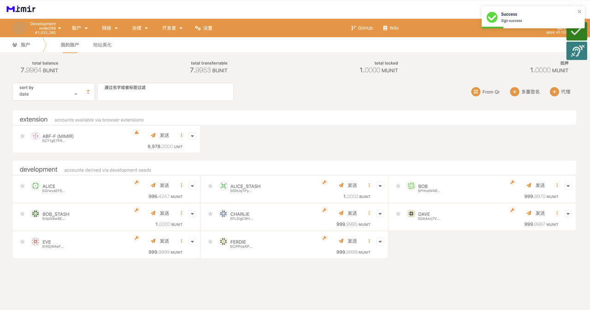
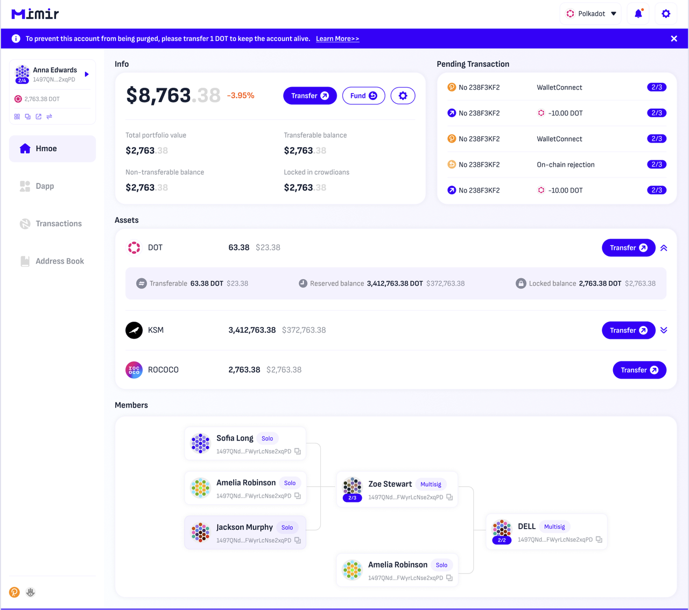

[TOC]

# Project Introduction(English Version)

project name：Mimir

start time：2023-10

## Background

> Terminology Explained: EOA, Externally Owned Account, is a standard single-signature account.

In the Ethereum ecosystem, Multisig has become a common requirement, evolving into one of the most significant applications in the realm of account abstraction. The largest Ethereum Multisig wallet, Safe, manages about 1% of all ETH assets (valued at $3 billion). Other concepts like Social Recovery and Seedless Login have also seen substantial project involvement and rule formulation.

Substrate, on the other hand, has long featured relevant functional modules such as the Multisig Pallet, Recovery, and Proxy. These can either independently provide or combine to offer powerful Account Abstraction (AA) functionalities. Furthermore, in the Polkadot network, Multisigs control 5% of all DOT assets. This demand for Multisig is five times that of Ethereum, indicating a more robust need among Polkadot ecosystem users.

However, within the current Polkadot ecosystem, non-EOA wallets face three primary challenges:

### 1.1 Account Creation and Management

**Challenge 1**: On a technical level, Polkadot provides account abstraction components like Multisig and Proxy in its code, but lacks corresponding productization. For example:

1. In the multisig pallet, there is no concept of a "Multisig address." Instead, all signatories are required, and the "Multisig address" is calculated on-chain.
2. Substrate does not natively support the concept of Flexible Multisig. It requires a combination of Multisig and Proxy modules to design an indirect proxy relationship between accounts.
3. Substrate is implemented in Rust, which is highly abstract and poses a greater challenge for developers.

**Challenge 2**: Polkadot supports a diverse range of account types, yet there is no product offering a unified management portal for them. Currently, the types of accounts in Polkadot can be broadly classified into the following categories:

- Standard single-signature accounts/extension wallet accounts
- Static Multisig
- Flexible Multisig
- Proxy accounts
- Derived accounts
- ...

Users have varying account usage needs in different scenarios. However, as of now, there is no product that provides unified management for these different types of accounts.

**Challenge 3**: Existing Polkadot Multisig products have limited support for different types of Multisig accounts, and the account hierarchy is simplistic. No product supports Nested Multisig accounts, where a Multisig account's member is another Multisig.

Safe, as Ethereum's leading Multisig application, demonstrates the significance of Nested Multisig accounts. Although they make up only 3% of all Multisig accounts in Safe, this small percentage controls 21% of ETH assets in Safe (approximately 300K ETH, about 20% of SAFE's total custodied assets). Users of these accounts include top DAO projects like Gnosis, BanklessDAO, Lido DAO, 1inch, Tornado Cash, Badger Finance, Frax Finance, MakerDAO, etc. This account type perfectly aligns with internal risk control processes in enterprises or DAOs, meeting the security management needs of large funds.

Further analysis reveals:

- Average assets managed by standard Multisigs: 6.6 ETH
- Nested Multisigs are divided into true asset custody Multisigs and auxiliary operation Multisigs, with asset custody Multisigs comprising about 19%. In these, the average assets custodied per account are 423 ETH. The average assets custodied by Nested Multisigs are about 64 times that of standard Multisigs.

We conclude that a product enhancing the operation types of Nested Multisig accounts in the Polkadot ecosystem could significantly contribute to its prosperity. Therefore, Mimir, in addition to supporting Static and Flexible Multisig, also supports any structure of EOA, Static, and Flexible Multisig in any nested combination. This empowers users to flexibly manage accounts according to their needs, catering to the complex fund custody and operational requirements of large institutions and DAOs.

> Data source: 
>
> Dune Number of Nested Multisig Accounts: [Dune Analysis](https://dune.com/queries/3285505) 
>
> ETH Managed by Standard Multisig vs. Nested Multisig: [Dune Analysis](https://dune.com/queries/3285508) 
>
> Top Projects Using Nested Multisig: [Dune Analysis](https://dune.com/queries/3285510)

### 1.2 Application

**Challenge 1**: Users face complexities in assembling transactions for non-EOA type accounts.

Currently, there is no product in the Polkadot ecosystem that offers a comprehensive transaction organization tool to help users assemble complex non-EOA account transactions, such as Nested Multisig or Multisig + Proxy transactions. These transactions require users to fill in numerous parameters.

Furthermore, if other members want to assist in processing these transactions, there are no convenient tools available for easily approving related operations.

**Challenge 2**: Non-EOA accounts in the Polkadot ecosystem cannot interact directly with applications.

In the Ethereum ecosystem, DAOs and DeFi heavily rely on the participation of large-volume funds in Multisig accounts, and even NFTs are increasingly seeing participation from Multisig accounts. For instance, about 15% of cryptoPunks, a leading Ethereum NFT project, are custodied in Multisig wallets.

In Polkadot, Staking and OpenGov are the most enticing sectors for heavy asset accounts. However, currently, no Multisig product can integrate with the aforementioned apps, resulting in most Multisig accounts being inactive.

In Mimir, users can smoothly use and manage assets within their wallets, enhancing fund participation. Subsequently, through an application access SDK, users will be able to conveniently use Multisig accounts to participate in Staking and OpenGov.

## Introducing Mimir

### Links

Dev: dev.mimir.global

Github: https://github.com/mimir-labs/mimir-wallet

Demo: https://youtu.be/amm_Vk0vzP4

### Logo

https://drive.google.com/file/d/1bE5gw1R6KTglS_rGwXwwnvc8SnDk1-rB/view?usp=sharing

### Product Introduction

Mimir is an all-in-one account and asset management tool in the Polkadot ecosystem.

#### Account Management

Mimir integrates various types of account systems. In the current version of Mimir, users can utilize the following types of account systems:

- **Extension Accounts** Users can access wallets within extensions through Mimir by authorizing the extension.
- **Multisig Accounts** Wallets controlled by multiple addresses offer higher security. In addition to supporting Polkadot's native Static Multisig accounts, Mimir also deeply supports two other types of Multisig - Flexible Multisig and Nested Multisig.
  - **Static Multisig Accounts** Static Multisig accounts, through the Multisig module, calculate the Multisig address off-chain, simplifying the user experience. However, their limitation lies in the inability to change member addresses, number, and thresholds.
  - **Flexible Multisig Accounts** Flexible Multisig is a feature Mimir developed by combining the Proxy and Multisig modules. It emulates the member-changing functionality of Ethereum's Safe Multisig. The comparison between Flexible and Static Multisig is illustrated in the following diagram:

|                   | Change Member | Change Threshold | Delete Account | Different addresses with same setting | Send transaction during creation |
| ----------------- | ------------- | ---------------- | -------------- | ------------------------------------- | -------------------------------- |
| Flexible Multisig | √             | √                | √              | √                                     | √                                |
| Static Multisig   | ×             | ×                | ×              | ×                                     | ×                                |

- **Nested Multisig Accounts** Mimir supports Nested Multisig accounts where a Multisig can include other Multisigs as its members. Users have the flexibility to choose between Flexible Multisig, Static Multisig, or EOA (Externally Owned Accounts) as members of a Multisig account. They can also structure these accounts in any hierarchical layering as needed. In the future, Mimir plans to integrate Proxy, enabling a hybrid architecture of Proxy and Multisig accounts. Additionally, Mimir will support social logins using zkLogin for enhanced user experience.

#### Transaction Management

##### Basic Transaction Management Functions

- **Approving Transactions** Mimir filters all local EOAs (Externally Owned Accounts) that are eligible to approve a transaction. Users do not need to switch accounts and can select any local EOA that meets the criteria to perform the 'Approve' operation.
- **Cancelling Transactions** If a user, as the initiator of a transaction, wishes to cancel it, they can do so directly from the Pending Transactions interface by clicking the 'Cancel' button.

##### Nested Multisig Transaction Management Functions

Nested Multisig transactions increase the complexity of status tracking. For such transactions, Mimir provides the following detailed transaction management functions:

- **Full Transaction Node Status Inquiry** After clicking on 'Overview,' users can view the current approval status of all account nodes involved in the transaction. This feature allows timely notifications to be sent to the respective account holders.

- **Transaction Sinking** For a given transaction, users can see the same transaction displayed within a child Multisig account, and they can perform approve/cancel operations as that Multisig entity.

- **Complex Transaction Cancellation** In Mimir, cancellation transactions initiated by a child Multisig account, once recorded on the chain, are also treated as Multisig transactions. Within the top-level Multisig account in Mimir, users can view all cancellation transactions associated with the child Multisig accounts linked to a particular transaction. This facilitates a comprehensive understanding of the current status of all related transactions.

#### Integration with Apps

##### Multisig Account Injection

Currently, Mimir has begun its initial implementation with Polkadot.js as a trial. After accessing Polkadot.js via Mimir-Dapp-General, users can view all Multisig accounts created through Mimir. They can then operate applications in the identity of these Multisig accounts.

##### Mimir Takes Over App Transaction Assembly and Progress Tracking

Transactions initiated by Multisig accounts through applications within Mimir will be displayed in Mimir's Pending Transaction section. Users no longer need to continue operating the application but can manage subsequent transaction processes directly in Mimir.

#### Asset Management

Users can view the balances of various assets in the currently selected account and perform quick operations.

### Comparation

|                       | Static Multisig | EOA Operation | Flexible Multisig | Sync Multisig        | Nested Multisig | Transaction Sinking | Integration Apps |
| --------------------- | --------------- | ------------- | ----------------- | -------------------- | --------------- | ------------------- | ---------------- |
| Mimir                 | ✅               | ✅             | ✅(One-Step)       | ✅                    | ✅               | ✅                   | ✅                |
| MultiX                | ✅               | ❌             | ❌                 | ❌                    | ❌               | ❌                   | ❌                |
| Polkasafe             | ✅               | ❌             | ✅(Multi-Steps)    | ❌(Not Available now) | ❌               | ❌                   | ❌                |
| Subscan multisig tool | ✅               | ❌             | ❌                 | ✅                    | ❌               | ❌                   | ❌                |

